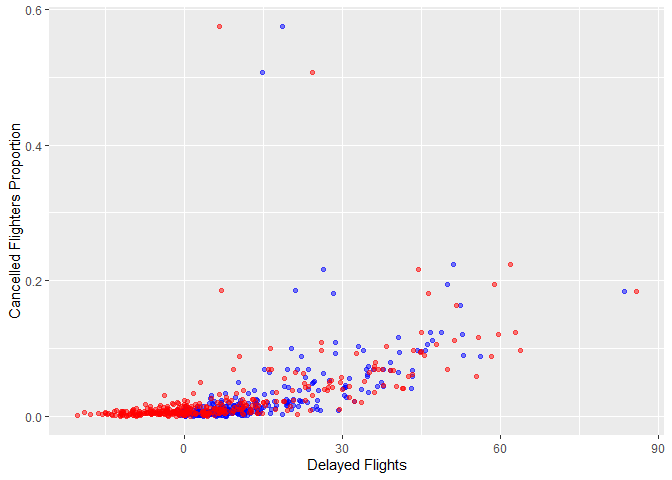

Stat433 HW1
================

``` r
library(dplyr)
```

    ## 
    ## Attaching package: 'dplyr'

    ## The following objects are masked from 'package:stats':
    ## 
    ##     filter, lag

    ## The following objects are masked from 'package:base':
    ## 
    ##     intersect, setdiff, setequal, union

``` r
library(nycflights13)
```

    ## Warning: package 'nycflights13' was built under R version 4.1.3

``` r
library(ggplot2)
```

``` r
flights %>% 
  filter(is.na(dep_time)) %>%
  summarise(n = nrow(.))
```

    ## # A tibble: 1 x 1
    ##       n
    ##   <int>
    ## 1  8255

``` r
# summary(flights)
```

## There are 8255 rows have the missing dep\_timed. Those missing values might represent cancelled flights and the flights the did not arrive the original destination.

2.  

``` r
flights_time_fixed = flights %>% 
  mutate(dep_time = (dep_time %/% 100) * 60 + (dep_time %% 100),
       sched_dep_time = (sched_dep_time %/% 100) * 60 + (sched_dep_time %% 100))
flights_time_fixed %>% summarise()
```

    ## # A tibble: 1 x 0

3.  ## Look at the number of canceled flights per day. Is there a pattern? Is the proportion of canceled flights related to the average delay? Use multiple dyplr operations, all on one line, concluding with ggplot(aes(x= ,y=)) + geom\_point()

``` r
flights.3 =  flights %>%
  group_by(year, month, day) %>%
  summarise(cancelled_flights = sum(is.na(dep_delay)), 
            total_flights_per_day = n(),
            mean_dep_delay = mean(dep_delay,na.rm=TRUE),
            mean_arr_delay = mean(arr_delay,na.rm=TRUE)) %>%
    ggplot(aes(y= cancelled_flights/total_flights_per_day)) + 
    geom_point(aes(x=mean_dep_delay), colour='blue', alpha=0.5) + 
    geom_point(aes(x=mean_arr_delay), colour='red', alpha=0.5) + 
    ylab('Cancelled Flighters Proportion') + xlab('Delayed Flights')
```

    ## `summarise()` has grouped output by 'year', 'month'. You can override using the `.groups` argument.

``` r
flights.3
```

<!-- -->

## Based on the plot, I believe there is no pattern exist, which means that proportion of canceled flights is not related to the average delay
